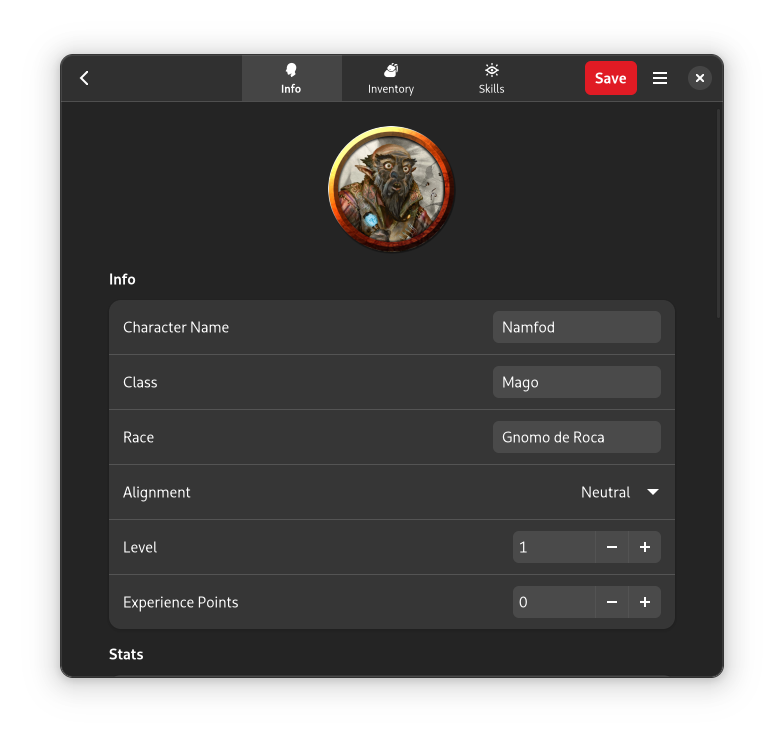

# Dungeon Journal



Dungeon Journal is a 5e character manager for the GNOME desktop environment.

<!-- ## Install

Make sure you have Flatpak installed. [Get more information](http://flatpak.org/getting.html)

<a href='https://flathub.org/apps/details/io.github.daved3464.DungeonJournal'>
    
</a> -->

---

## Building

Dungeon Journal can be built and run with [Gnome Builder](https://wiki.gnome.org/Apps/Builder) >= 41.
Just clone the repo and hit the run button!
You can get Builder from [here](https://wiki.gnome.org/Apps/Builder/Downloads).

You also can build Dungeon Journal manually without using Flatpak:

```
git clone https://github.com/tryton-vanmeer/DungeonJournal.git
cd DungeonJournal
mkdir build
cd build
meson ..
ninja
```

**Note:** Additional to the standard dependencies (GTK 4, Vala, ...), you will need the following dependencies:

- json-glib
- libadwaita

---

Credits to the original creator.

**Tryton Van Meer** <trytonvanmeer@gmail.com>
